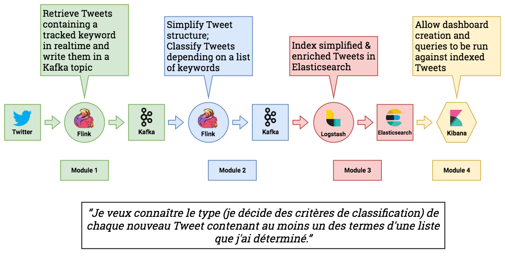
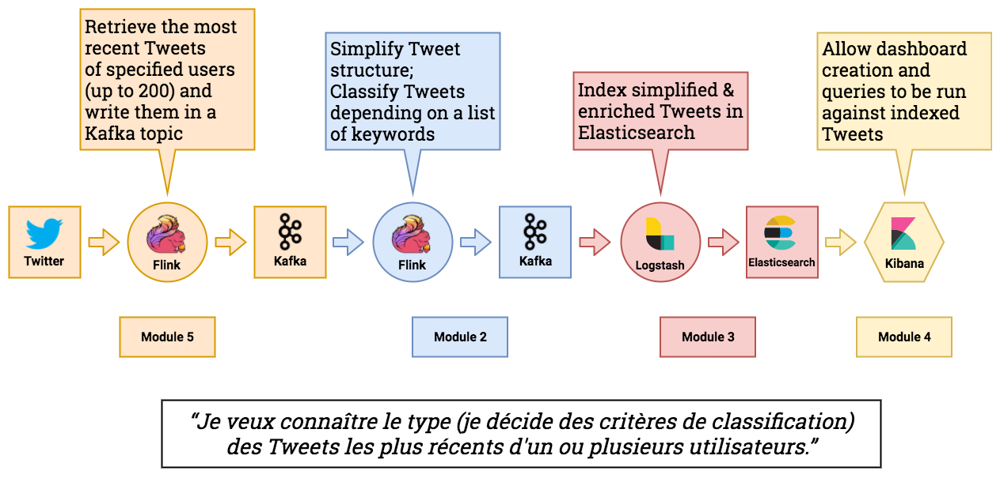

# Pipelines

## Pipeline 1

### Configuration

All fields in `config/pipeline1.cfg` must be set:

* `trackedKeywords`: A comma-separated list of keywords to track which will be used to determine what Tweets will be delivered on the stream. See [track](https://developer.twitter.com/en/docs/tweets/filter-realtime/guides/basic-stream-parameters) for more informations
* `classificationFile`: The absolute path to a `.csv` file used to append a Label to each Tweet. The file must have the following structure: _term, label, weight._
  * _term_: the term to track \(case-insensitive\)
  * _label_: the label to associate with the tracked term
  * _weight_: the relative weight of the term. Used when determining the main label of a Tweet; Defaults to 1.

## Pipeline 2

### Configuration

All fields in `config/pipeline2.cfg` must be set:

* `userIds`: A comma-separated list of user IDs to retrieve historical Tweets from
* `tweetCount`: The number of Tweets to retrieve for each user; cannot exceed 3200
  * See [here](https://developer.twitter.com/en/docs/tweets/timelines/api-reference/get-statuses-user_timeline.html) for more information about the limits
* `queryCount`: The maximum number of requests for each user \(a maximum of 200 Tweets can be served for a single request\)
* `classificationFile`: The absolute path to a `.csv` file used to append a Label to each user. The file must have the following structure: _term, label, weight._
  * _term_: the term to track \(case-insensitive\)
  * _label_: the label to associate with the tracked term
  * _weight_: the relative weight of the term. Used when determining the main label of a Tweet; Defaults to 1.

